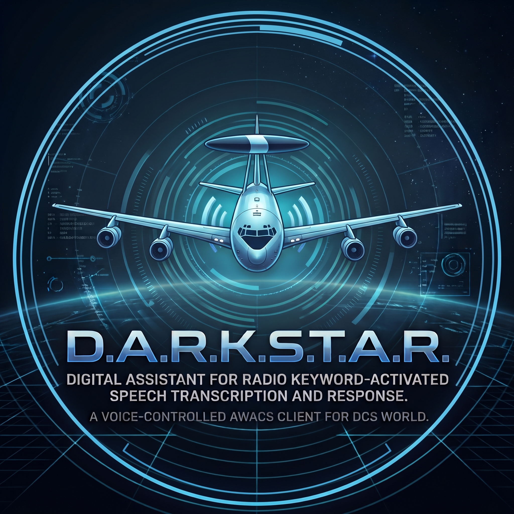

<p align="center">
    
</p>


# D.A.R.K.S.T.A.R.

**D**igital **A**ssistant for **R**adio **K**eyword-activated **S**peech **T**ranscription **A**nd **R**esponse

*🇬🇧 [This page in English](README.md)*

Ein sprachgesteuerter Funk-Assistent für [DCS World](https://www.digitalcombatsimulator.com/), der sich als External-AWACS-Client mit einem [DCS-SimpleRadio-Standalone](https://github.com/ciribob/DCS-SimpleRadio-Standalone)-Server (SRS) verbindet.

Ein Pilot drückt auf einer überwachten Frequenz die Sendetaste, sagt das Hotword und stellt eine Frage — der Bot transkribiert sie, ermittelt eine Antwort und funkt sie mit synthetischer Stimme zurück.

> *„Overlord, bogey dope."*
> *„Enfield 1-1, this is Overlord… Bogey, bearing zero, niner, zero, thirty five miles, twenty two thousand, hot, group of two, type MiG-29."*

## 📖 Dokumentation

**Alles steht im Handbuch — Installation, jede Einstellung, Bedienung am Funk, Fehlersuche:**

### → **[Vollständiges Handbuch (Deutsch)](docs/manual-de.md)** · **[Full manual (English)](docs/manual-en.md)**

Nachschlagewerke: [Konfigurationsfelder](docs/configuration.md) · [Konfigurationseditor](docs/gui.md) · [Installer bauen](docs/building-the-installer.md) · [Mitarbeiten](docs/contributing.md) · [Änderungen](docs/changelog.md) *(englisch)*

## Funktionen

| | |
|---|---|
| 🎙️ **Hotword offline** | [Vosk](https://alphacephei.com/vosk/) transkribiert lokal und achtet auf dein Schlüsselwort. Kein Account, keine Kosten pro Anfrage, kein Audio verlässt dafür den Rechner. |
| 📈 **Messbare Genauigkeit** | Richtige Anti-Aliasing-Filterung im Detektor-Audio, plus `--test-hotword`, um echte Aufnahmen erneut durchlaufen zu lassen und Treffer und Fehlschläge zu zählen statt zu raten. |
| 🗣️ **Für Nicht-Muttersprachler gebaut** | Ein Hotword kann die Schreibweisen akzeptieren, die der Erkenner wirklich produziert („over lord" für „Overlord"), und `--suggest-variants` ermittelt diese Liste aus deinen eigenen Aufnahmen — inklusive Warnung bei Varianten, die Fehltrigger verursachen würden. |
| 🛰️ **Antworten aus der laufenden Mission** | „bogey dope", „picture", „threat check" und „alpha check" aus echten DCS-Daten über [DCS-gRPC](https://github.com/DCS-gRPC/rust-server) — BRAA mit Aspect vom eigenen Flugzeug aus oder im Bullseye-Format. |
| 🤝 **Wo ist mein Rottenflieger?** | Optional, standardmäßig aus: die Position eines anderen menschlichen Spielers deiner Seite, gemessen von deinem Flugzeug. Nie KI, nie die Gegenseite, und nie für einen Anrufer, dessen Seite nicht bestimmbar ist. |
| ✅ **Radio Check, der etwas aussagt** | „Loud and clear" auf jeder Frequenz — und mit Missionsdaten dazu, ob der Bot dich wirklich auf dem Schirm hat. Antwortet, bevor irgendetwas anderes schiefgehen kann. |
| 🛫 **Bahn in Benutzung und ATIS** | Echter Wind, Temperatur und Druck, plus das Bahnende, das der Wind tatsächlich begünstigt. |
| ⭕ **Threat Circle** | Ein Pilot schaltet eine mitfliegende Überwachung scharf („threat circle forty miles") und wird gewarnt, sobald ein Feind eindringt. |
| 📻 **Mehrere Radios gleichzeitig** | Jede Frequenz mit eigenem Hotword, Rufzeichen, **eigener Stimme**, Gesprächsverlauf **und Aufgabe** — Taktik auf der AWACS-Frequenz, Bahn und ATIS auf dem Tower. Drei Radios klingen nach drei Personen. Wer den falschen anruft, wird weitergeleitet. |
| 💬 **Feste Phrasen oder freie Antworten** | Bekannte Frage-/Antwortpaare werden direkt bedient; alles andere geht an Google Gemini oder wird abgelehnt — deine Entscheidung. |
| 🎯 **Realistische Sensorlogik** | Nur melden, was eine konfigurierte KI-AWACS tatsächlich erfasst — oder alles, was in der Mission fliegt. |
| 🛡️ **Koalitionsbewusst** | Kann die Gegenseite vollständig ignorieren, so wie es ein echter Funkkreis täte. |
| 🖥️ **Konfigurationseditor** | Desktop-GUI für jede Einstellung, mit DCS-gRPC-Verbindungstest, nur lesendem Missionsdaten-Explorer und Dienstverwaltung per Knopfdruck. |
| 📦 **Installer in einer Datei** | Eine `Setup.exe`, die auf einem nackten Windows alle Laufzeitabhängigkeiten mitinstalliert. |

## Installation

1. **`DARKSTAR-Setup-<Version>.exe`** von der [Releases](../../releases)-Seite herunterladen.
2. Ausführen — sie installiert Bot, Konfigurationseditor, ein Sprachmodell und jede fehlende Runtime und legt eine `config.json` an, die schon auf das Modell und auf deine SRS-Installation zeigt.
3. Konfigurationseditor öffnen, SRS-Server, Radios und Gemini-API-Key eintragen, speichern, starten.

Schritt für Schritt, samt allem, was schiefgehen kann: **[Handbuch, Kapitel 3](docs/manual-de.md#3-installation)**.

## Voraussetzungen

| | Wofür | Anmerkung |
|---|---|---|
| **Windows** | alles | Antworten laufen über `DCS-SR-ExternalAudio.exe` und Windows-TTS-Stimmen. |
| **SRS-Server** | alles | Samt `ExternalAudio\DCS-SR-ExternalAudio.exe`, worüber der Bot sendet — der Installer findet die Datei selbst. |
| **[Gemini-API-Key](https://aistudio.google.com/apikey)** | Transkription, freie Antworten | Die kostenlose Stufe reicht für Tests und kleine Gruppen. |
| **[Vosk-Modell](https://alphacephei.com/vosk/models)** | Hotword | Liegt dem Installer bei. Offline, kostenlos, ohne Account. |
| .NET 8 Desktop Runtime, VC++ Redistributable, WebView2 | Betrieb von Bot und GUI | Werden vom Installer **automatisch** nachinstalliert, falls sie fehlen. |
| **[DCS-gRPC](https://github.com/DCS-gRPC/rust-server)** | taktische Antworten, Threat Circle | Optional. Ohne läuft alles andere trotzdem. |
| [.NET 8 SDK](https://dotnet.microsoft.com/download/dotnet/8.0) + Visual Studio 2022 | nur zum Bauen aus dem Quellcode | Für die reine *Nutzung* nicht nötig. |

## Projektaufbau

```
Darkstar.csproj, *.cs        Der Bot: SRS-Verbindung, Audio, Hotword, Antworten
  └── Darkstar.Core/         Gemeinsame Bibliothek: Konfiguration, Phrasen, Logging, DCS-gRPC, Dienstverwaltung
  └── Darkstar.Gui/          Konfigurationseditor (Blazor Hybrid über WPF)
  └── Darkstar.Tests/        Die Testsuite — dotnet run --project Darkstar.Tests
installer/                   Inno-Setup-Skript für die auslieferbare Setup.exe
docs/                        Die gesamte Dokumentation
.github/workflows/           Baut und testet jeden Push
build-installer.ps1          Baut die Setup.exe (Release, Abhängigkeiten, Sprachmodell, ein Befehl)
setup-dev-environment.ps1    Richtet einen Entwicklungsrechner ein
```

`Darkstar.csproj` liegt bewusst direkt im Wurzelverzeichnis — seine Projektverweise zeigen relativ zu sich selbst auf `Darkstar.Core\`. In einem Unterordner lässt sich die Solution nicht mehr laden.

### Tests ausführen

```powershell
dotnet run --project Darkstar.Tests
```

Gibt ein lesbares Protokoll aus und endet mit 0, wenn alles gehalten hat. Dafür braucht es keinen SRS-Server, kein DCS, keinen Gemini-Key und kein Sprachmodell — geprüft werden Rechenwege, gesprochene Sätze, und ob Code und Dokumentation noch übereinstimmen.

## Lizenz

GPL-3.0 — siehe [LICENSE](LICENSE).
